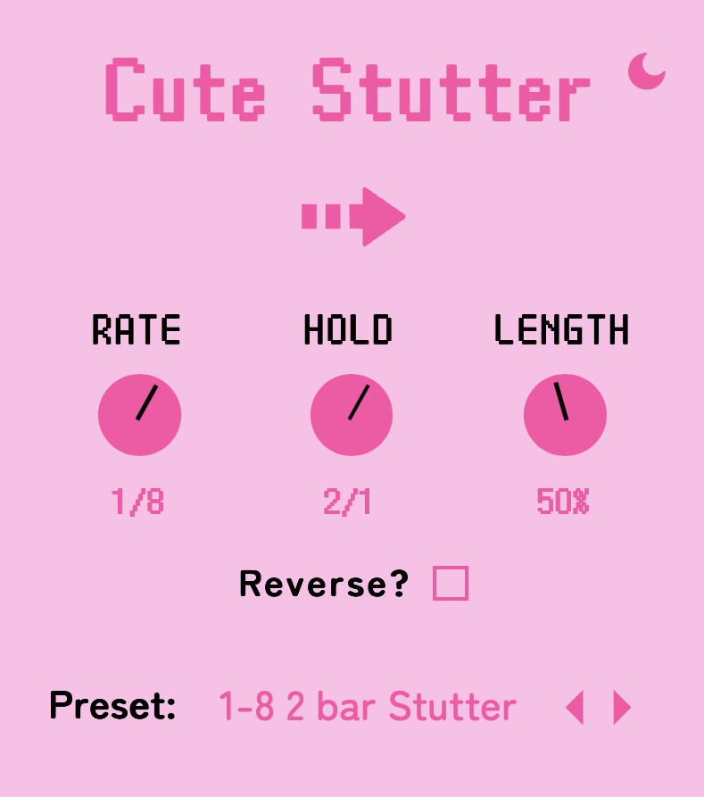

# Cute Stutter

Cute Stutter is a VST plugin for repeating stutter effects.

### Controls:
- Rate - The speed of the stutter in bpm synced times. For your convenience, the lowest position is "Off" to bypass the effect. 
- Hold - How long the stutter holds for before restarting again in bpm synced times. 
- Length - Shorten the duration of the stutter for a gate effect, expressed as a percentage. 
- Reverse - Plays back the stutter in reverse. 

### Design

Our design is available here: https://www.figma.com/design/26RsAEelFv7M072yLkKg47/Cute-Stutter

### Purchase

### See Also

- [Cute Stop](https://github.com/Moebytes/Cute-Stop) 
- [Cute Reverse](https://github.com/Moebytes/Cute-Reverse)